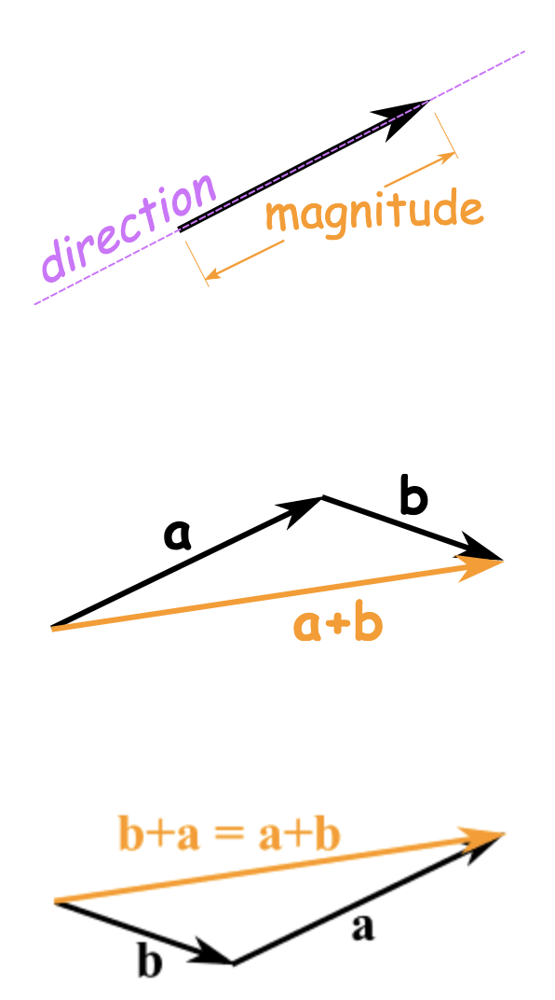
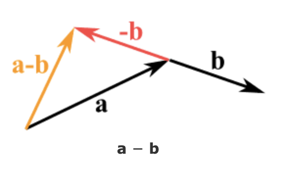
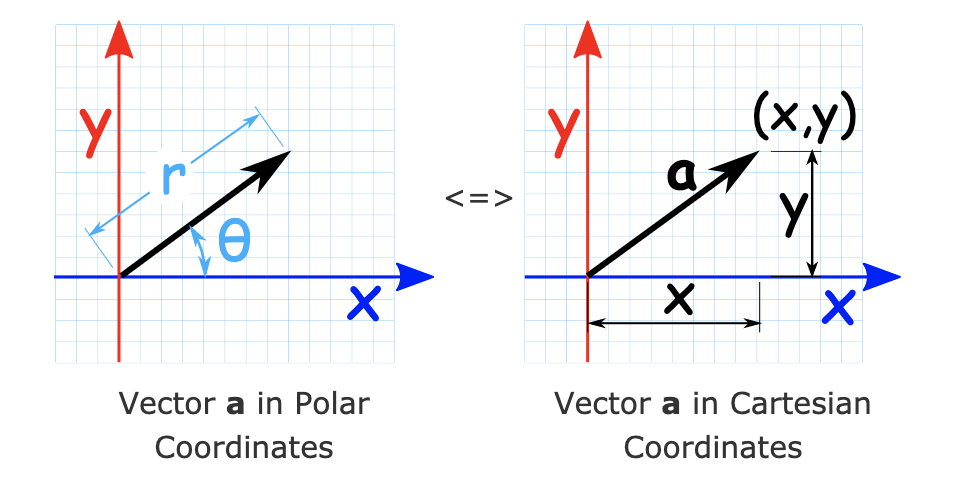

# Vector

A vector has a magnitude and direction. The length of the line shows its magnitude and the arrowhead points in the direction. We can add two vectors by joining them head-to-tail. And it doesn't matter which order we add them, we get the same result.

We can also subtract one vector from another. First, we reverse the direction of the vector we want to subtract, then add them as usual.

## **Adding Vector**

We can add vectors by adding the x parts and adding the y parts**.**

$$
a = (8,13),
b = (26,7),
c = (8, 13) + (26, 7) = (8+26, 13+7) = (34, 20)
$$

## **Magnitude of a Vector**

$$
|a| = \sqrt( x^2 + y^2 )
$$

Magnitude of the vector,$$|b| = (6,8) = \sqrt( 6^2 + 8^2) = \sqrt( 36+64) = \sqrt100 = 10$$ 

## **Multiplying a Vector by a Vector**

* **Dot Product - Result is a Scaler**
  * $$a \cdot b = \lvert a \lvert \times \lvert b \lvert \times cos (\theta)$$ 
  * Multiply the length of a times the length of b, then multiply by the cosine of the angle between a and b.
  * Or, we can use the formula $$a \cdot b = a_x \times b_x + a_y \times b_y$$ 
  * Multiply the x's, multiply the y's, then add.
* **Cross Product - Results a Vector**
  * Cross Product a × b of two vectors is another vector that is at right angles to both.
  * $$a \times b = \lvert a \lvert \times \lvert b \lvert \times sin (\theta) \times n$$ 

## Polar and Cartesian Coordinates







